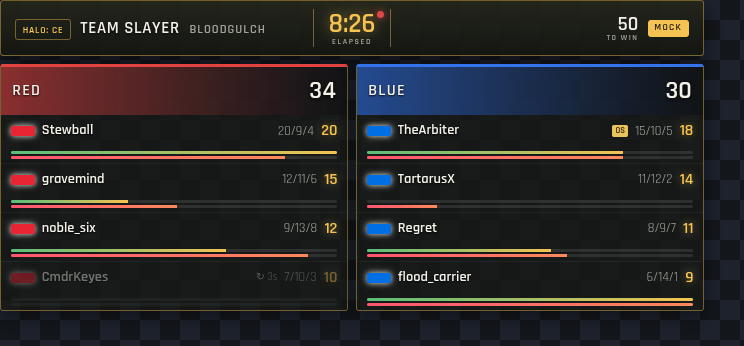
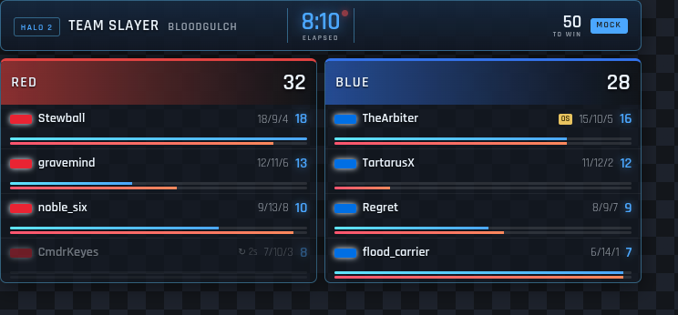
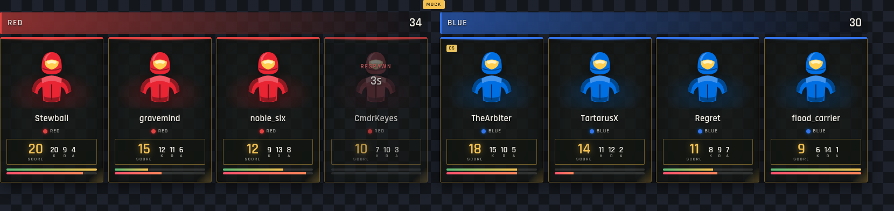
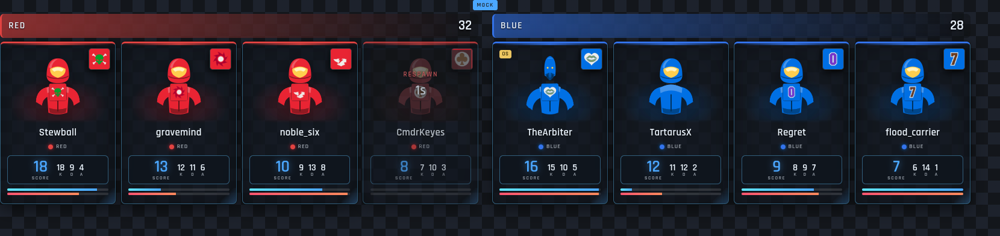
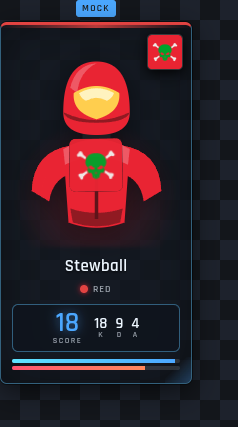
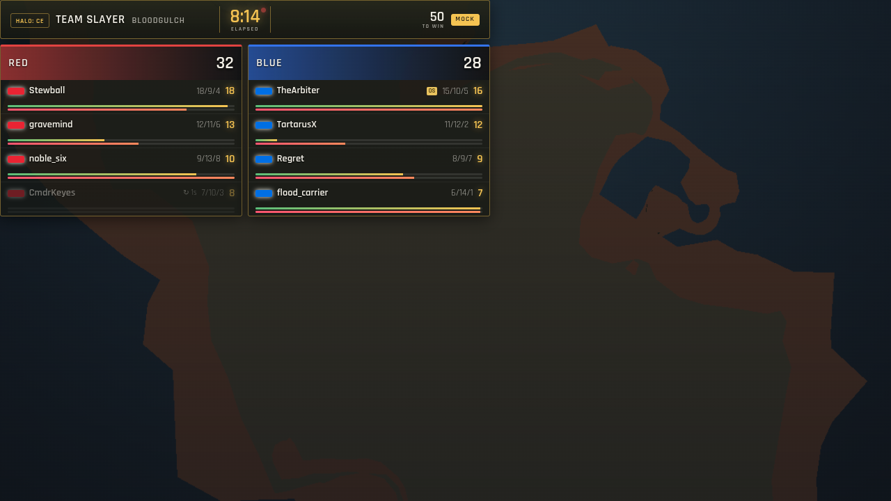

# M28 — Broadcast graphics (themed scoreboard + player cards)

> **Status:** In progress (CE mock-verified; live CE pass + H2 theme pending H2 scraper)
> **Started:** 2026-07-01
> **Completed:** —
> **Depends on:** [M25 — OBS spectator overlays](M25-obs-overlays.md) (overlay-feed + view builders + transparent-canvas convention), Stream Studio (`feat/stream-assets-studio` — asset registry + `/studio/` hub), [M10 — Overlay revamp](M10-overlay-revamp.md) (scoped overlay token), `feat/profile-appearance` (`CharacterPreview` / `EmblemPreview` + CE/H2 armor palettes)

## Goal

Ship the first **broadcast-grade** OBS browser sources — the "hero" graphics a streamer drops into a scene and it renders live and looks native to the game being played. Where M25 shipped functional-but-plain overlays (a compact roster panel, a status strip), M28 adds two visually-designed, **per-game-themed** surfaces that use the project's real assets (the tinted Spartan/Elite busts, H2 emblems, exact armor-colour palettes) and the live CE scrape:

1. **Broadcast scoreboard** — the canonical overlay: a themed header (gametype · map · match clock · score-to) over team columns (or an FFA ranked list), each row an armor-chipped player with K/D/A, score, and health/shield vitals.
2. **Player cards** — a bottom strip of per-player cards, each a Spartan tinted by the player's armor colour (Halo 2 also carries the player's emblem), with gamertag, K/D/A, and a big score. Plus a **single-card "spotlight"** variant keyed by roster slot.

Everything renders through a **per-game theme** (`ce` / `h2`) so a CE stream reads in UNSC amber/green and an H2 stream reads in the cool-blue menu language — the same live data, two visual languages, selected by `?game=`.

## Scope

**In:**

- Two new transparent overlay routes under `/overlays/[instance]/` (inherit the chrome-hiding + transparent-canvas treatment):
  - `scoreboard/` — the broadcast scoreboard.
  - `cards/` — the player-cards strip.
  - `card/[slot]/` — single-player spotlight card (documented URL; not a `/studio/` gallery tile since it needs a slot).
- A **per-game theme layer** ([`$lib/components/broadcast/theme.ts`](../../sveltekit/src/lib/components/broadcast/theme.ts)) emitting `--bc-*` CSS custom properties, so the markup is game-agnostic and the CE↔H2 look is a data swap.
- A shared **player-card component** ([`BroadcastPlayerCard.svelte`](../../sveltekit/src/lib/components/broadcast/BroadcastPlayerCard.svelte)) reusing `CharacterPreview` (Spartan/Elite bust tinted by armor colour) + `EmblemPreview` (H2 emblem).
- Registry wiring: four `/studio/` tiles (CE + H2 for each of scoreboard + cards); the H2 ones are theme previews flagged pending the H2 scraper.
- Reuse of the M25/Studio plumbing unchanged: `createOverlayFeed` (so `?mock=1` previews with no game/token), `buildScoreboard` / `matchClock` / `statusStrip` view builders, `overlay-mock`.

**Out (deferred / follow-up):**

- Live **H2** data (roster / scores / **emblems**) — needs the H2 scraper (`feat/halo2-scraper`, M20). The H2 theme is preview-only today.
- Live-verified per-player **K/D/A + score** on CE — inherited best-effort from M25 (`hasScores` gate; muted to `—` when all-zero) until a real match pass.
- Real armor **pose** variants / MCC-accurate skins (held branches `feat/spartan-real-poses`, `feat/emblem-exact-palettes`) — the cards use the shipped `CharacterPreview` bust; swapping in richer art is a drop-in follow-up.
- FFA screenshot (mock is a team game); the FFA branch is implemented + rendered, just not captured here.

## Architecture

- **Theme** — `broadcastTheme(game)` returns a `BroadcastTheme` (accents, panel fills, header gradient, corner radius, tracking); `themeVars(theme)` serialises it to a `--bc-*` declaration string set on each route's wrapper. `parseGame(?game=)` normalises to `ce` (default) / `h2`. Pure, unit-tested ([`theme.test.ts`](../../sveltekit/src/lib/components/broadcast/theme.test.ts)). This file is overlay **chrome** only — the per-player Spartan tint still comes from the armor palette (`CE_COLORS` / `H2_COLORS` in `$lib/utils/emblem`).
- **Shared params** — `overlayParams(instance, url)` projects `[instance]` + `?token=/mock=/scale=/game=` into one bundle for all three routes; pure, unit-tested ([`overlay-params.test.ts`](../../sveltekit/src/lib/utils/overlay-params.test.ts)).
- **Player card** — `BroadcastPlayerCard` consumes a `PlayerRow` + `game` + `teamColor` + `isTeamGame` + the player's resolved `profile`. Two pure rules ([`components/broadcast/player.ts`](../../sveltekit/src/lib/components/broadcast/player.ts), unit-tested):
  - **Team-vs-FFA colour** (`resolveArmorIndex`): in a TEAM game every player on a team shares ONE team colour (colour does NOT tell teammates apart — the emblem + gamertag do); FFA is per-player + distinct. Accurate to the game.
  - **Profile-avatar merge** (`cardAppearance`): the player's gamertag PROFILE emblem, re-coloured to the game-accurate armor so a team game still reads team-coloured. CE has no emblem (the visible CE-vs-H2 difference). A profile-less player renders a plain tinted Spartan — no generic placeholder emblem (`CharacterPreview` gains `armorOverride` + `showEmblem` props for exactly this).
- **Profile lookup** — [`stores/broadcast-profiles.svelte.ts`](../../sveltekit/src/lib/stores/broadcast-profiles.svelte.ts) resolves each rostered gamertag → its profile appearance. Live: batch-GETs the public **`GET /api/public/profiles?gamertags=`** endpoint ([`routes/public_profiles.go`](../../internal/pocketbase/routes/public_profiles.go)) — cosmetic-only + read-only, because the owner-scoped `ce_profiles`/`h2_profiles` can't be read by an anonymous overlay. Mock: synthesised from `overlay-mock.mockProfiles()`.
- **Scoreboard** joins `buildScoreboard(game, tick)` (team/FFA rows + `hasTick`/`hasScores`), `matchClock(game)` (elapsed/countdown), and `statusStrip(game, scenario)` (map + score limit) — all existing pure builders. Rows use a wrap-flex layout (robust to the optional rank / respawn / vitals cells); the row armor-chip follows the same team-vs-FFA colour rule.
- **Flush canvas** — each route's root is a content-sized (`width: fit-content`) box flush at the top-left origin — no outer padding/margin — so the OBS browser source has no dead frame; the streamer positions + spaces it in the scene.
- **Mock** — `overlay-mock` provides the sample match; `mockProfiles()` supplies per-seed profile avatars (one seed intentionally profile-less, to preview the graceful fallback). Live H2 avatars source `appearance` from the profiles endpoint once the H2 scraper populates profiles.

## CE-ready-now vs H2-pending

| Surface | CE (live-capable now) | H2 |
| --- | --- | --- |
| Broadcast scoreboard | ✅ renders on live CE feed (K/D/A + team score best-effort until a live pass — M25 caveat) | 🎨 **theme only** — needs the H2 scraper for roster/scores |
| Player cards | ✅ Spartan tint + gamertag + score on live CE | 🎨 **theme only** — cards render, but live roster needs the H2 scraper |
| Profile avatar (emblem) | — (CE has no emblem system, by design) | ✅ resolves via `/api/public/profiles` when a player has an H2 profile; graceful fallback otherwise. Populated live once the H2 scraper writes profiles |

CE is the shippable target today; H2 is wired end-to-end against mock so the moment the H2 scraper lands, the same routes light up live with `?game=h2`.

## How to add these in OBS

1. In OBS: **Sources → + → Browser Source**.
2. **URL:** mint a scoped overlay token at `/overlays/manage/` (or the `/studio/` "Copy OBS URL" button) for your container, then use:
   - Scoreboard — `https://<host>/overlays/<instance>/scoreboard/?token=<token>`
   - Player cards — `https://<host>/overlays/<instance>/cards/?token=<token>`
   - Single card — `https://<host>/overlays/<instance>/card/<slot>/?token=<token>` (`<slot>` = roster player index)
   - Halo 2 theme — append `&game=h2`.
   - Style/size without a game — use `?mock=1` (no token needed).
3. **Size the source to the content.** Each graphic renders flush at the top-left of the browser source with no outer margin, so set the source width/height to the graphic (or larger — the extra is transparent) and position it in your scene. Use `&scale=<0.5..3>` to resize.
4. Leave **"Shutdown source when not visible"** off so the socket stays warm. The background is transparent — it composites straight over your game capture.

## Previews

Mock data (`?mock=1`), flush overlay shown over a checkerboard (and one composited over the Blood Gulch map render). Note the team-colour rule (teammates share the team armor colour) and the H2 profile emblems distinguishing same-coloured teammates.

**Broadcast scoreboard — Halo: CE / Halo 2 theme** (flush top-left; per-row chips follow the team colour)

**Player cards — Halo: CE / Halo 2 theme.** Teammates share the team armor colour; the H2 card wears each player's **profile emblem** (chest + corner badge) so colour-identical teammates are still distinct. `TartarusX` has no profile → plain Spartan (graceful fallback); the Arbiter is an Elite.

**Single-card spotlight (H2 — profile avatar)** · **scoreboard composited over gameplay (map render stand-in)**

## Verification

- Frontend: `pnpm check` / `pnpm lint` / `pnpm test` (282, +21 new: theme, params, player rules) / `pnpm build` — green.
- Backend: `go build` / `go vet` / `go test ./internal/pocketbase/routes/` (public-profiles helpers) — green.
- Headless 1920×1080 mock renders of all three routes in both themes, over a checkerboard + a busy scene (above).
- **Pending:** live CE match pass (confirms K/D/A + team scores render, not just mock; and profile avatars resolve against real profiles); H2 roster (blocked on the H2 scraper).

## Log

_Append-only. Never edit past entries; add a new dated line._

- 2026-07-01: created. Themed scoreboard + player-cards + single-card routes on `feat/broadcast-graphics`, reusing the M25/Studio overlay-feed + view builders + `CharacterPreview`/`EmblemPreview`. Per-game `--bc-*` theme layer (CE amber/green vs H2 blue). Registry: 4 `/studio/` tiles (CE live, H2 theme-preview). Mock enriched with distinct armor colours + `mockAppearance`. CE mock-verified; live CE + all H2 pending.
- 2026-07-01: Stewart refinements. (1) **Flush canvas** — dropped the outer padding/centering frame; each route renders content-sized flush at the origin so OBS has no dead margin. (2) **Team-vs-FFA colour rule** — teammates now share the accurate team armor colour (colour no longer distinguishes teammates); FFA stays per-player (`resolveArmorIndex`). (3) **Profile avatars** — cards use the player's gamertag-PROFILE Spartan + H2 emblem (so colour-identical teammates are told apart by emblem), resolved via a new public cosmetic-only `GET /api/public/profiles` endpoint + the `broadcast-profiles` lookup store; graceful fallback to a plain Spartan when a player has no profile (`CharacterPreview` gained `armorOverride`/`showEmblem`). Pure rules unit-tested (`player.ts`); Go helpers unit-tested (`public_profiles_test.go`). Re-shot previews.
